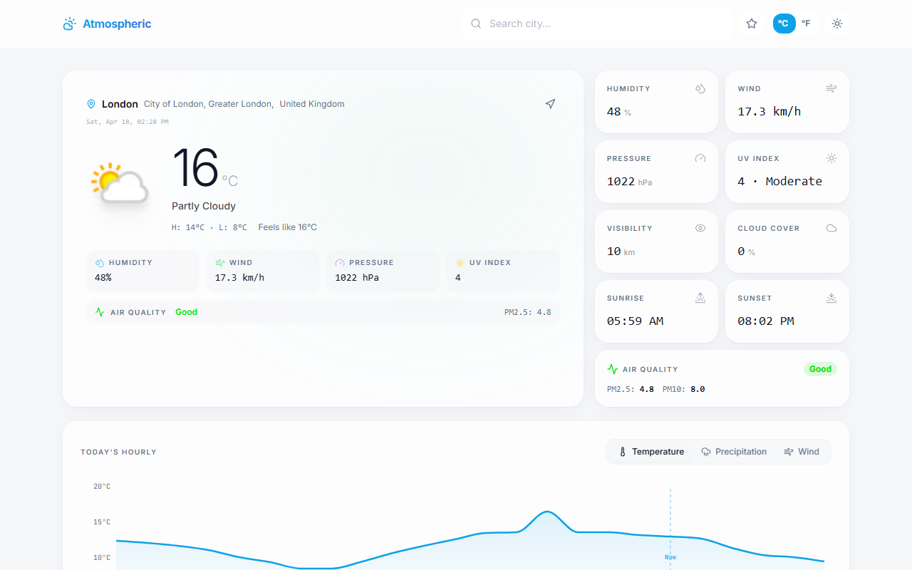
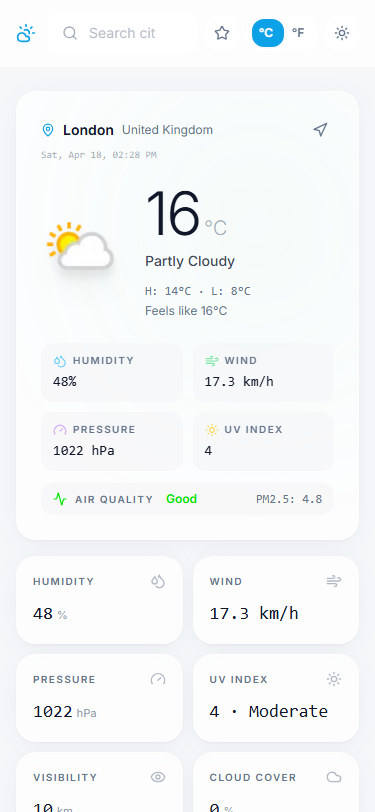

<div align="center">
# 🌤️ Atmosphere
### A premium weather dashboard built for the modern web
*Real-time forecasts · Interactive charts · Air quality · PWA-ready*
</div>

## 📸 App Showcase

<div align="center">
  
  <br />
  <i><strong>1. Clean Dashboard</strong> — Real-time weather data with beautiful, interactive visualizations.</i>
</div>
<br/>
<div align="center">
  
  <br />
  <i><strong>2. Fully Responsive</strong> — Mobile-first design that feels like a native app on any device.</i>
</div>
<br/>

---

[](https://atmosphere-weather-app.vercel.app)
[](https://supabase.com)
[](https://react.dev)
[](https://typescriptlang.org)


---

## What is Atmosphere?

Atmosphere is a full-stack weather application that delivers beautiful, data-rich forecasts for any city in the world. It was built to feel fast, look stunning on every screen, and work even when you're offline.

This project goes beyond basic CRUD — it involves real API orchestration through serverless edge functions, reactive state management with custom hooks, interactive data visualization, and a polished design system built with Tailwind CSS and shadcn/ui.

---

## ✨ Features

| Feature | Details |
|---|---|
| **Live weather data** | Current conditions, 7-day forecast, hourly breakdown via WeatherAPI.com |
| **Interactive charts** | Temperature, precipitation & wind graphs with tap-to-inspect tooltips (Recharts) |
| **Smart city search** | Debounced autocomplete — searches as you type, no button needed |
| **Saved locations** | Star any city and jump back to it in one tap |
| **Air quality index** | PM2.5, PM10, and US EPA AQI with color-coded severity |
| **Dark / light mode** | System-aware theme with instant toggle, zero flash on load |
| **Offline support** | Shows last-fetched data with a clear offline indicator |
| **PWA ready** | Add to home screen on iOS/Android — feels completely native |
| **Unit toggle** | Switch °C/°F and km/h/mph globally across all views |
| **Fully responsive** | Mobile-first design that scales gracefully to large screens |

---

## 🛠️ Tech Stack

```
Frontend      React 18 + TypeScript + Vite
Styling       Tailwind CSS + shadcn/ui (Radix UI primitives)
Animations    Framer Motion
Charts        Recharts
State         TanStack Query + custom React hooks
Forms         React Hook Form + Zod validation
Backend       Supabase Edge Functions (Deno runtime)
Weather API   WeatherAPI.com
Testing       Vitest + Testing Library + Playwright (E2E)
Deployment    Vercel (frontend) + Supabase (edge functions)
```

---

## 🏗️ Architecture

```
Browser (React + Vite)
    │
    ├── TanStack Query  ──►  cache + background refetch
    │
    └── Supabase Client
            │
            ├── /functions/weather       ← 7-day forecast + air quality
            └── /functions/city-search   ← city autocomplete
                        │
                        └── WeatherAPI.com  (external)
```

> The frontend never calls WeatherAPI directly. All requests go through Supabase Edge Functions — keeping the API key server-side, enabling rate limiting, and making it easy to swap providers later.

---

## 🚀 Getting Started

### Prerequisites

- Node.js 18+
- A free [Supabase](https://supabase.com) account
- A free [WeatherAPI](https://weatherapi.com) key

### Local setup

```bash
# 1. Clone the repo
git clone https://github.com/YOUR_USERNAME/atmosphere-weather-app.git
cd atmosphere-weather-app

# 2. Install dependencies
npm install

# 3. Set up environment
cp .env.example .env
# Add your VITE_SUPABASE_URL and VITE_SUPABASE_ANON_KEY

# 4. Deploy edge functions
supabase link --project-ref YOUR_PROJECT_REF
supabase secrets set WEATHERAPI_KEY=your_key_here
supabase functions deploy weather --no-verify-jwt
supabase functions deploy city-search --no-verify-jwt

# 5. Run locally
npm run dev
```

Visit [http://localhost:5173](http://localhost:5173) — you're live.

---

## 🔐 Environment Variables

| Variable | Where to get it |
|---|---|
| `VITE_SUPABASE_URL` | Supabase → Project Settings → API |
| `VITE_SUPABASE_ANON_KEY` | Supabase → Project Settings → API |
| `WEATHERAPI_KEY` | Stored as a Supabase secret — never exposed to the browser |

---

## 📁 Project Structure

```
src/
├── components/
│   ├── weather/           # Domain-specific components
│   │   ├── CurrentWeather.tsx
│   │   ├── ForecastRow.tsx
│   │   ├── HourlyGraph.tsx
│   │   ├── SearchBar.tsx
│   │   └── MetricsGrid.tsx
│   └── ui/                # shadcn/ui base components (Radix)
├── hooks/                 # Custom React hooks
│   ├── use-geolocation.ts
│   ├── use-theme.ts
│   └── useDebounce.ts
├── lib/
│   ├── weather-store.tsx   # Global state + TanStack Query logic
│   ├── weather-types.ts    # TypeScript interfaces & enums
│   └── weather-utils.ts    # Pure utility functions (unit conversion etc.)
├── pages/
│   ├── Index.tsx           # Home — current weather view
│   └── ForecastDetail.tsx  # Expanded day detail view
└── integrations/
    └── supabase/           # Auto-generated client + TypeScript types

supabase/
└── functions/
    ├── weather/            # 7-day forecast edge function (Deno)
    └── city-search/        # Autocomplete edge function (Deno)
```

---

## 🧪 Scripts

```bash
npm run dev          # Dev server → localhost:5173
npm run build        # Production build
npm run preview      # Preview production build locally
npm run test         # Run unit tests (Vitest)
npm run test:watch   # Watch mode
npm run lint         # ESLint check
```

---

## ☁️ Deployment

**Backend (Supabase):** Edge functions are deployed via Supabase CLI. The `WEATHERAPI_KEY` is stored as a server-side secret — never visible to the browser.

**Frontend (Vercel):** Connect your GitHub repo to Vercel, add the two `VITE_` env variables, and every push to `main` triggers an automatic build and deploy.

---

## 💡 Key Technical Decisions

- **Edge functions as a proxy** — keeps third-party API keys off the client, adds a natural place for caching and rate limiting
- **TanStack Query** — `staleTime` tuning makes the app feel instant on repeat visits without unnecessary network calls  
- **Custom debounce hook** — prevents search race conditions without adding a library dependency
- **Framer Motion** — weather condition transitions are animated but interruptible, so fast users never feel blocked
- **Vitest over Jest** — native ESM support and near-instant HMR made the test loop dramatically faster during development

---

## 📄 License

MIT — use this freely as a template, learning reference, or starting point for your own projects.

---

<div align="center">
  <sub>Built with care · Powered by real data · Works in the rain</sub>
</div>
